## ***Documentation:*** 📋📋

⏩⏩⏩⏩⏩⏩⏩⏩⏩⏩⏩⏩
## 1.Reverse an Array 📄

** we made a function called reverseArray which takes an array as an argument, return an array with elements in reversed order. 🎇

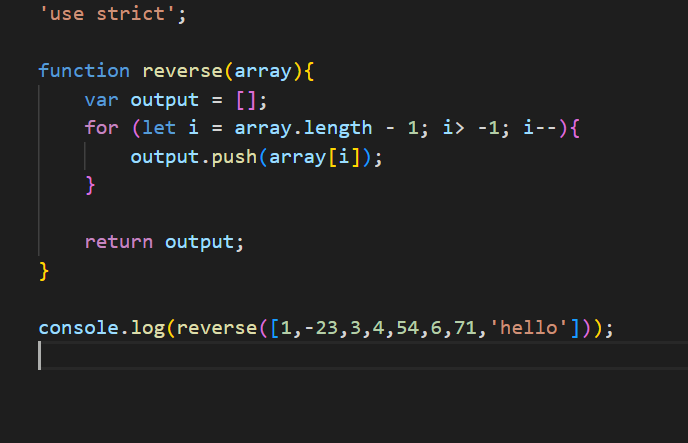

## Whiteboard Process: 🗒
<!-- 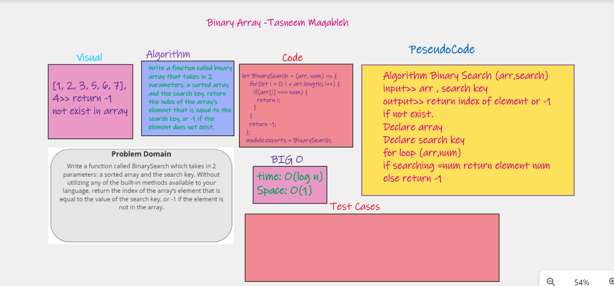 -->

## Approach & Efficiency:⏱
1.used for loop to revers the array with push method. 
2.The Big O time is O(n) and / Space is O(1)

----------------------------------------------------
 
⏩⏩⏩⏩⏩⏩⏩⏩⏩⏩⏩⏩ 

## 2.Shift Array 📄
** we made a function called ShiftArray takes in an array and a value to be added. Without utilizing any of the built-in methods available to your language, return an array with the new value added at the middle index.
 
 

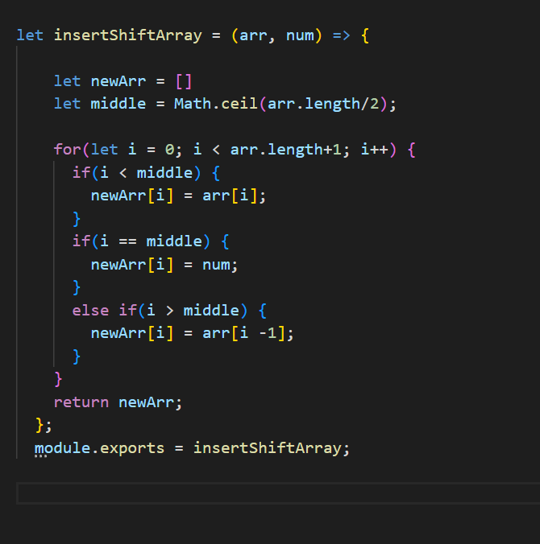

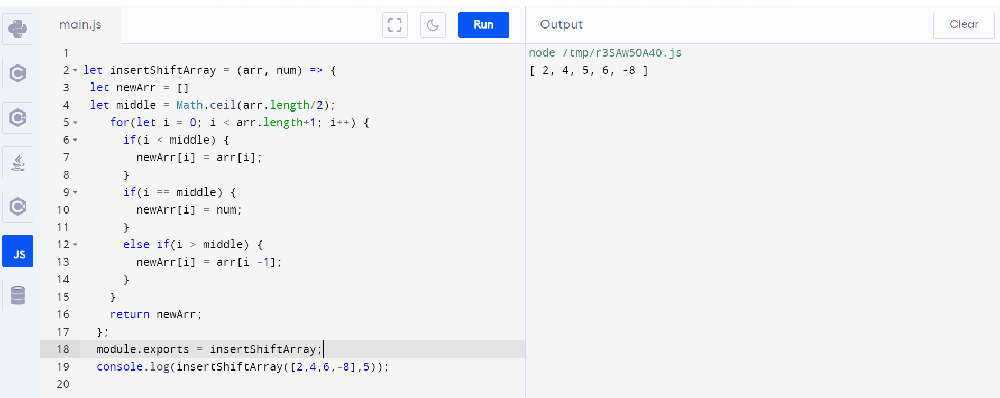
 

## Whiteboard Process: 🗒
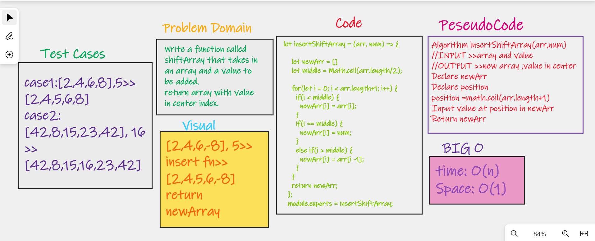
 

## Approach & Efficiency:⏱
used for loop to shift the array
  
----------------------------------------------------
[Back to Code Challenge Folder](../../code-challenges/)

----------------------------------------------------
⏩⏩⏩⏩⏩⏩⏩⏩⏩⏩⏩⏩
##  Singly Linked Lists:
Linked List, like arrays, is a linear data structure. It contains head, tail and length properties. As shown below, each element in linked list is a node, which has a value and a reference to next node, or if it’s tail, points to null.

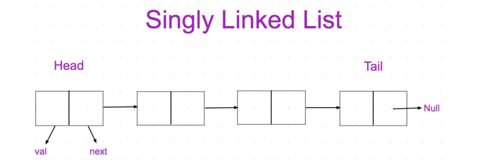

## Challenge: 💪 💪
* Create a Node class that has properties for the value stored in the Node, and a pointer to the next Node.

* Create a Linked List class

* Create a Linked List Test

## Approach & Efficiency: ⏱⏱
* insert(value)

O(1) space efficency

O(1) time efficency

* includes(value)

O(1) space efficency

O(n) time efficency

* toString()

O(1) space efficency

O(n) time efficency

## API: ⏩
* insert>>> 
Arguments: value 
Returns: nothing 
Adds a new node with that value to the head of the list with an O(1) Time performance. 
 
* includes>>> 
Arguments: value 
Returns: Boolean 
Indicates whether that value exists as a Node’s value somewhere within the list.
 
 
* to string>>
Arguments: none 
Returns: a string representing all the values in the Linked List, formatted as: 
"{ a } -> { b } -> { c } -> NULL"

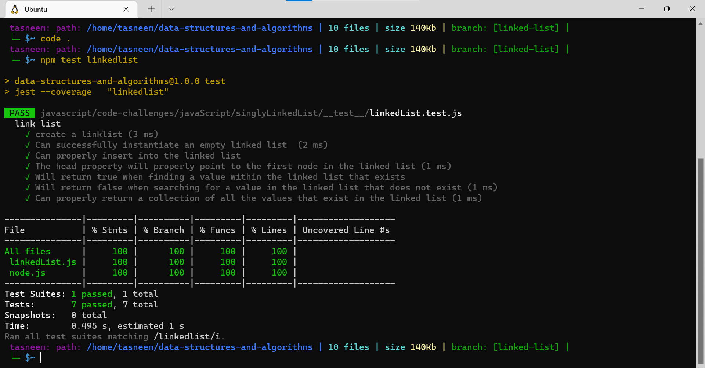

---------------------------------------------------------
⏩⏩⏩⏩⏩⏩⏩⏩⏩⏩⏩⏩
##  array-binary-search :
built the BinarySearch function to take in the desired inputs. we go through each element in a for loop checking to see if the element currently iterated on equals the second parameter value. if it does, pass the index of that value, if it never finds a match, return -1 

## Challenge: 💪 💪
Write a function called BinarySearch which takes in 2 parameters: a sorted array and the search key. Without utilizing any of the built-in methods available to your language, return the index of the array’s element that is equal to the search key, or -1 if the element does not exist.

## Approach & Efficiency: ⏱⏱
1.used for loop to revers the array with return result 
2.The Big O time is O(log n) and / Space is O(1) 

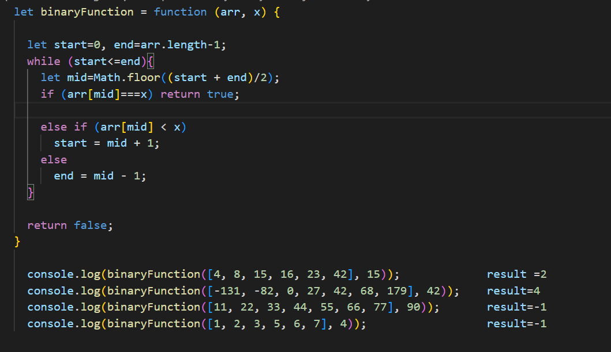

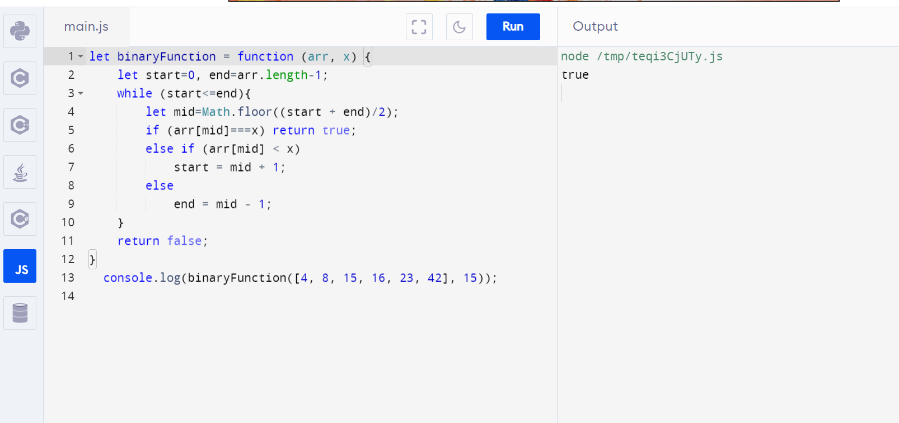

## Whiteboard Process: 🗒

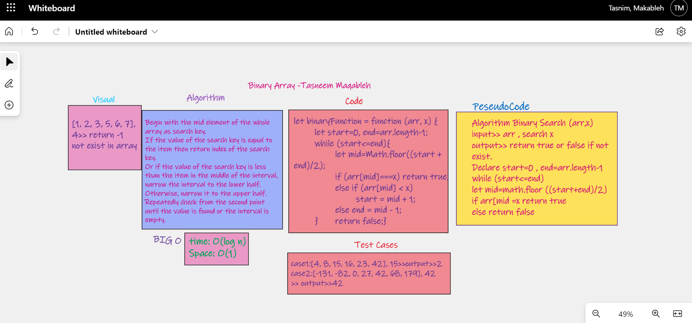.

⏩⏩⏩⏩⏩⏩⏩⏩⏩⏩⏩⏩
## Code Challenge- Class 06 : linked-list-insertions

need to create a link list constructor class along with methods to do the desired insertions actions.

## Challenge:💪 💪
create a linked list class that has methods to append, insert before, and insert after nodes.

## Approach & Efficiency: ⏱⏱
- The Big O time is O(n)
- Space is O(1) 

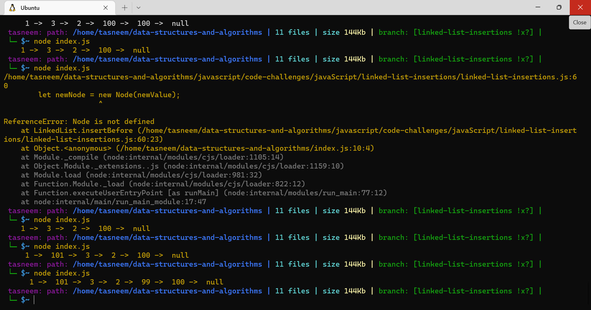;
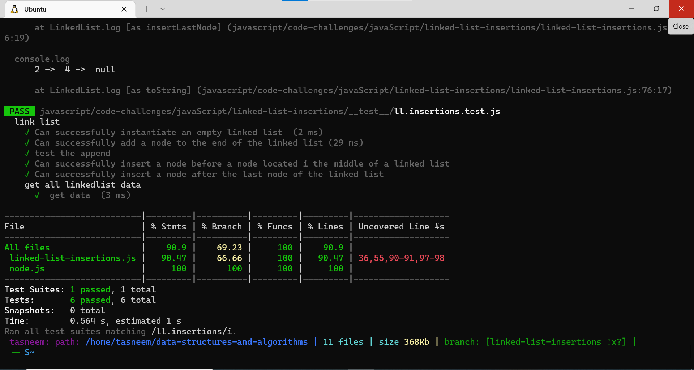;

## WhiteBoard:

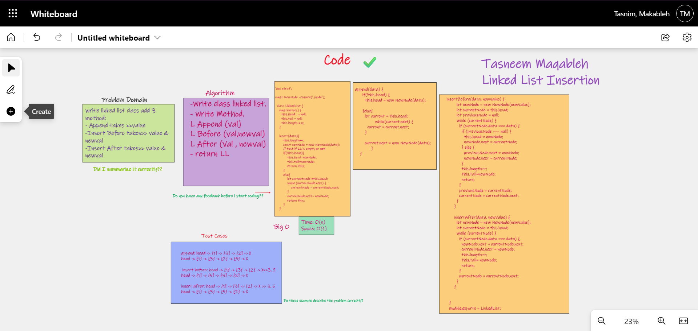

⏩⏩⏩⏩⏩⏩⏩⏩⏩⏩⏩⏩
## Linked List Kth From End

need to create a link list constructor class along with method to do the desired search action

## Challenge💪 💪
create a linked list class that has a method to append nodes simply to have something to work with and a method used to search for specific nodes in the linke list and return the value

## Approach & Efficiency: ⏱⏱
- The Big O time is O(n)
- Space is O(1) 

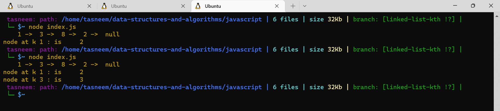
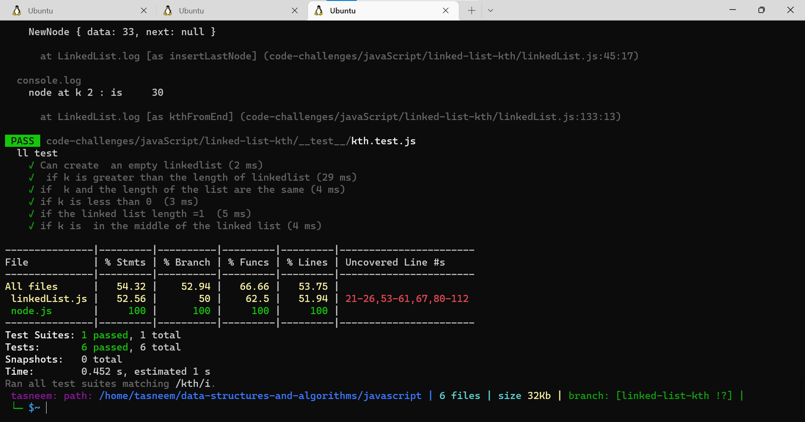

## WhiteBoard:

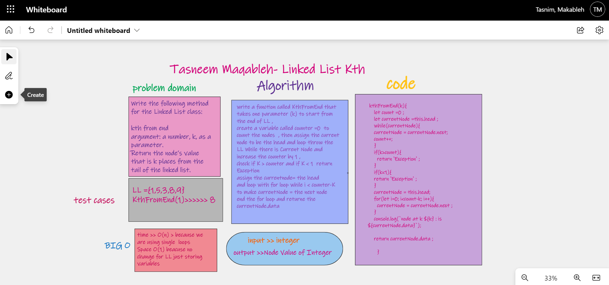

⏩⏩⏩⏩⏩⏩⏩⏩⏩⏩⏩⏩
## linked-list-zip

## Challenge💪 💪
Write a function called zipLists which takes two linked lists as arguments. Zip the two linked lists together into one so that the nodes alternate between the two lists and return a reference to the head of the zipped list. Try and keep additional space down to O(1)

## Approach & Efficiency: ⏱⏱
write a function that take two linked lists as arguments
check if one of the lists is empty , and return the other one
declare two variables and asign the head to them for each linked list
keep looping if there is values in list1
if there is a value in list2
keep putting a value from list1 then a value from list2
return the new list

### Big O
- The Big O time is O(1)
- Space is O(n) 
 

## code ll-zip:
[ll zip](../javaScript/linked-list-zip) 
 

## WhiteBoard:
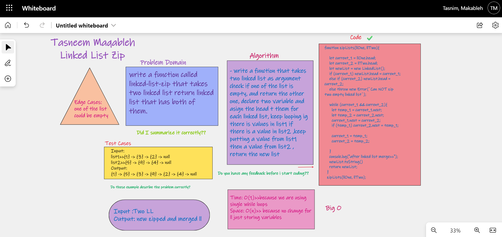

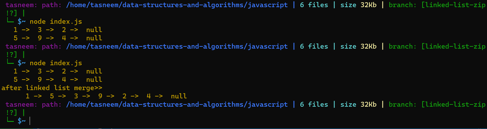

---------------------------------
⏩⏩⏩⏩⏩⏩⏩⏩⏩⏩⏩⏩
## stack-and-queue
[stack-and-queue](./stack-queue//stackandqueue.MD)

---------------------------------
⏩⏩⏩⏩⏩⏩⏩⏩⏩⏩⏩⏩
## stack-queue-pseudo
[stack-queue-pseudo](./stack-queue-pseudo/stack-queue-pseudo.md)

---------------------------------
⏩⏩⏩⏩⏩⏩⏩⏩⏩⏩⏩⏩
## stack-queue-animal-shelter
[stack-queue-animal-shelter](../javaScript/animal-shelter/animal-shelter.md)

---------------------------------
⏩⏩⏩⏩⏩⏩⏩⏩⏩⏩⏩⏩

stack-queue-brackets

[stack-queue-brackets.md ](../javaScript/stack-queue-brackets/stack-queue-brackets.md)

⏩⏩⏩⏩⏩⏩⏩⏩⏩⏩⏩⏩

trees  

[trees](./trees/trees.md)

⏩⏩⏩⏩⏩⏩⏩⏩⏩⏩⏩⏩

tree-breadth-first>>>>>>

[tree breadth first.md](./tree-breadth-first/tree-breadth-first.md)

⏩⏩⏩⏩⏩⏩⏩⏩⏩⏩⏩⏩

tree-fuzz-buzz>>>>>>>>>>>>>>>>>

[tree fuzz buzz](./tree-fizz-buzz/tree-fizz-buzz.md)

⏩⏩⏩⏩⏩⏩⏩⏩⏩⏩⏩⏩

Insertion Sort>>>>>>>>>>>>>>>>>>

[Insertion Sort](./insertionSort/insertionSort.md)

