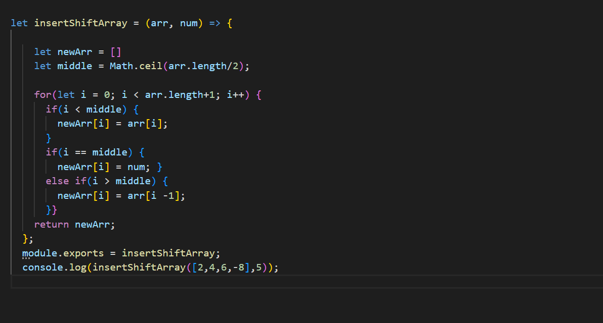
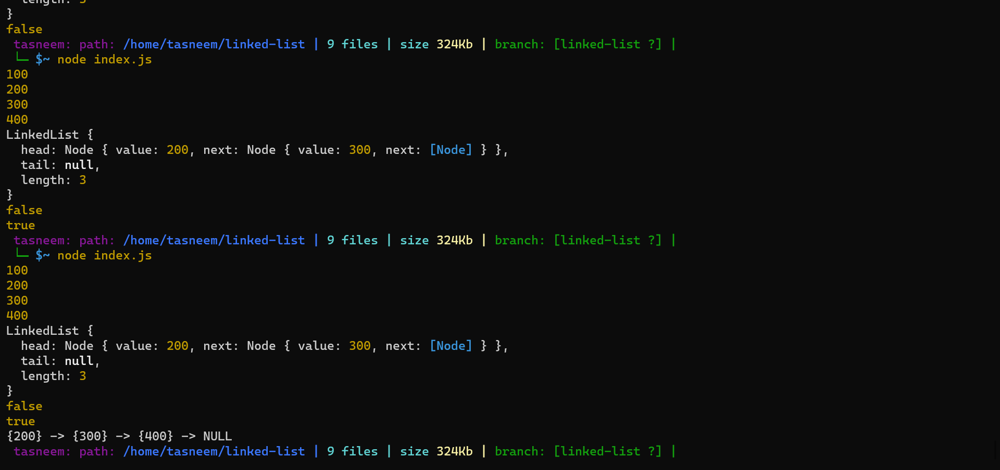

## ***Documentation:*** 📋📋

⏩⏩⏩⏩⏩⏩⏩⏩⏩⏩⏩⏩
## 1.Reverse an Array 📄

** we made a function called reverseArray which takes an array as an argument, return an array with elements in reversed order. 🎇

## Whiteboard Process: 🗒

## Approach & Efficiency:⏱
1.used for loop to revers the array with push method. 
2.The Big O time is O(n) and / Space is O(1)

----------------------------------------------------
 
⏩⏩⏩⏩⏩⏩⏩⏩⏩⏩⏩⏩ 

## 2.Shift Array 📄
** we made a function called ShiftArray takes in an array and a value to be added. Without utilizing any of the built-in methods available to your language, return an array with the new value added at the middle index.
 
 

 

## Whiteboard Process: 🗒

 

## Approach & Efficiency:⏱
used for loop to shift the array
  
----------------------------------------------------
[Back to Code Challenge Folder](../../code-challenges/)

----------------------------------------------------
⏩⏩⏩⏩⏩⏩⏩⏩⏩⏩⏩⏩
##  Singly Linked Lists:
Linked List, like arrays, is a linear data structure. It contains head, tail and length properties. As shown below, each element in linked list is a node, which has a value and a reference to next node, or if it’s tail, points to null.

## Challenge: 💪 💪
* Create a Node class that has properties for the value stored in the Node, and a pointer to the next Node.

* Create a Linked List class

* Create a Linked List Test

## Approach & Efficiency: ⏱⏱
* insert(value)

O(1) space efficency

O(1) time efficency

* includes(value)

O(1) space efficency

O(n) time efficency

* toString()

O(1) space efficency

O(n) time efficency

## API: ⏩
* insert>>> 
Arguments: value 
Returns: nothing 
Adds a new node with that value to the head of the list with an O(1) Time performance. 
 
* includes>>> 
Arguments: value 
Returns: Boolean 
Indicates whether that value exists as a Node’s value somewhere within the list.
 
 
* to string>>
Arguments: none 
Returns: a string representing all the values in the Linked List, formatted as: 
"{ a } -> { b } -> { c } -> NULL"

