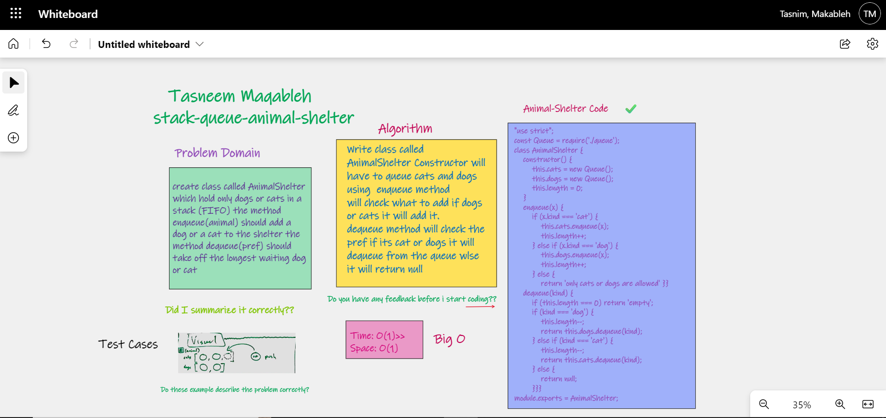

⏩⏩⏩⏩⏩⏩⏩⏩⏩⏩⏩⏩
## stack-queue-animal-shelter
make an animla shelter that takes in only dogs and cats and when someone wants either a dog or a cat they are given the longest waiting one

## Challenge💪 💪
create class called AnimalShelter which hold only dogs or cats in a stack (FIFO) the method enqueue(animal) should add a dog or a cat to the shelter the method dequeue(pref) should take off the longest waiting dog or cat

## Approach & Efficiency ⏱⏱
Enqueue: space O(1)/time O(1) Dequeue: space O(1)/time O(1).

## WhiteBoard : 

