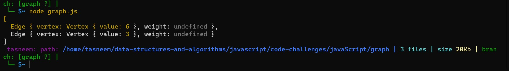

## Graphs

## Challenge
- implement the Graph with the main methods and with :
1. AddNode()
2. AddEdge()
3. GetNodes()
4. Size()

## Approach & Efficiency
I created new Map() for adding the vertecies as keys and edges as values to that vertes while these edges link between connected verticies

## API
- AddNode() Adds a new node to the graph Takes in the value of that node Returns the added node AddEdge()
- Adds a new edge between two nodes in the graph Include the ability to have a “weight” Takes in the two nodes to be connected by the edge Both nodes should already be in the Graph
- GetNodes() Returns all of the nodes in the graph as a collection (set, list, or similar)
- GetNeighbors() Returns a collection of edges connected to the given node Takes in a given node Include the weight of the connection in the returned collection
- Size() Returns the total number of nodes in the graph

---------------------------------------------------------
## breadth-first traversal on a graph

## Challenge Summary
Implement a breadth-first traversal on a graph.

## Challenge Description
Extend your graph object with a breadth-first traversal method that accepts a starting node. Without utilizing any of the built-in methods available to your language, return a collection of nodes in the order they were visited. Display the collection.

## Approach & Efficiency
I used a Set DS which add unique values inside it.

 

## Result Terminal >>

## Test >>

