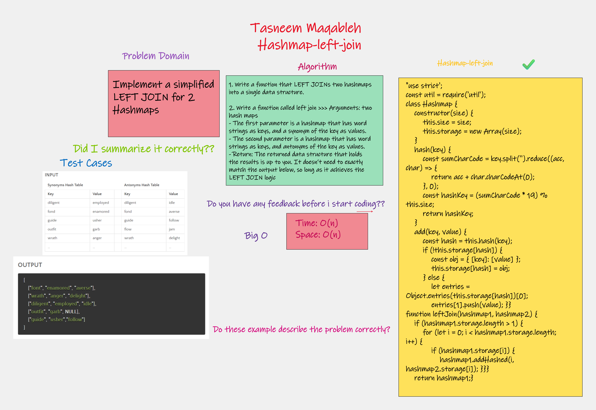
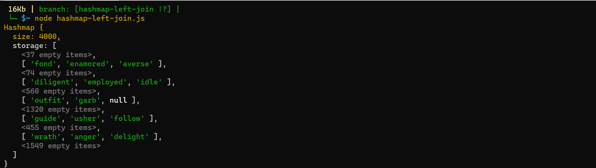

## hashmap-left-join 

## Challenge Summary
Implement a simplified LEFT JOIN for 2 Hashmaps

## Challenge Description
1. Write a function that LEFT JOINs two hashmaps into a single data structure.

2. Write a function called left join >>> Arguments: two hash maps
- The first parameter is a hashmap that has word strings as keys, and a synonym of the key as values.
- The second parameter is a hashmap that has word strings as keys, and antonyms of the key as values.
- Return: The returned data structure that holds the results is up to you. It doesn’t need to exactly match the output below, so long as it achieves the LEFT JOIN logic

## Approach & Efficiency>>
- Time: O(n)
- Space: O(n)

## Code Hashmap-left-join
[hashmap-left-join.js](./hashmap-left-join.js)

## WhiteBoard >>

## Solution >>

