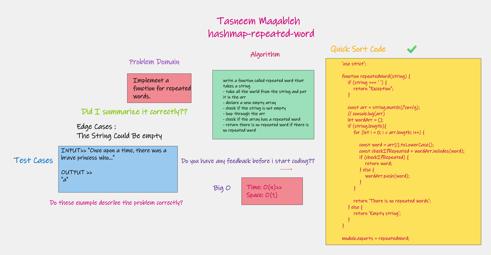
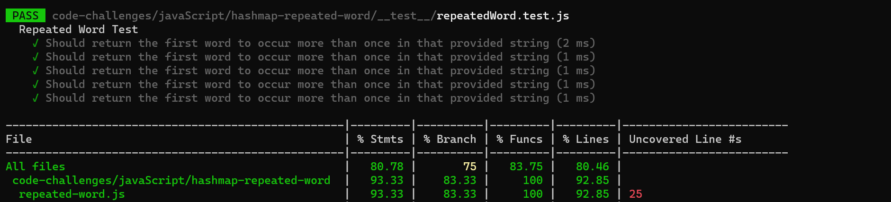

## hashmap-repeated-word

## Challenge Summary
Implement a function for repeated words.

## Challenge Description
Write a function that accepts a lengthy string parameter. Without utilizing any of the built-in library methods available to your language, return the first word to occur more than once in that provided string.

## Approach & Efficiency
- take all the world from the string and put it in the arr
- declare a new empty array
- check if the string is not empty
- loop through the arr
- check if the array has a repeated word
- return there is no repeated word if there is no repeated word

## Big O
Time: O(n) Space: O(1)

## Code hashmap-repeated-word >>
[hashmap-repeated-word link code](./repeated-word.js)

## WhiteBoard >>

## Test >>

