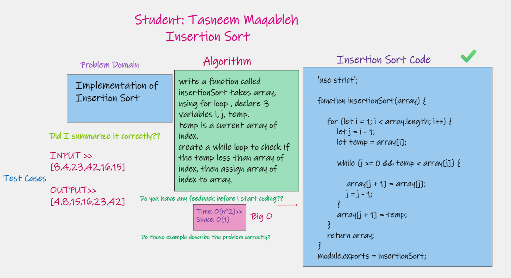
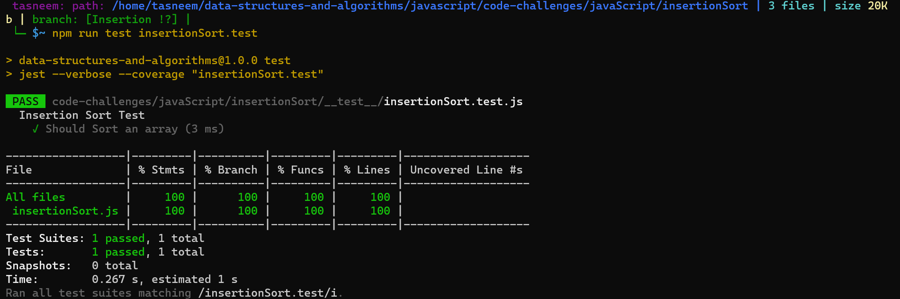
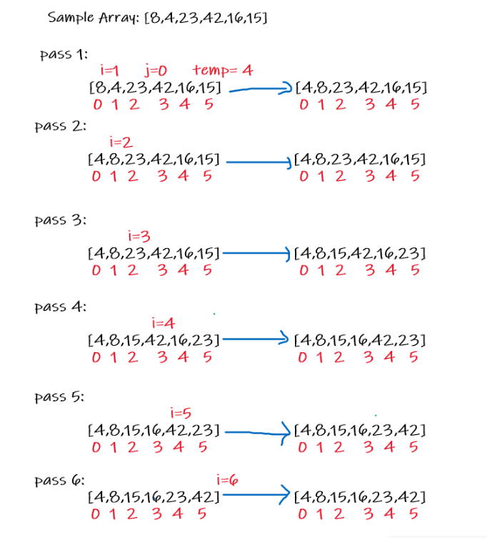

⏩⏩⏩⏩⏩⏩⏩⏩⏩⏩⏩⏩

## Insertion Sort

## Challenge Summary >>>>>>>>
Insertion sort is a simple sorting algorithm that works similar to the way you sort playing cards in your hands. The array is virtually split into a sorted and an unsorted part. Values from the unsorted part are picked and placed at the correct position in the sorted part.

## ## Challenge 💪 💪
Review the pseudocode below, then trace the algorithm by stepping through the process with the provided sample array. Document your explanation by creating a blog article that shows the step-by-step output after each iteration through some sort of visual.

## Big O
Time: O(n^2) Space: O(1)

 

## Pseudocode

  InsertionSort(int[] arr)

    FOR i = 1 to arr.length

      int j <-- i - 1
      int temp <-- arr[i]

      WHILE j >= 0 AND temp < arr[j]
        arr[j + 1] <-- arr[j]
        j <-- j - 1

      arr[j + 1] <-- temp

     
     
     
  

 ## WhiteBoard >>>

 ## Insertion Sort Code >>>>

 [code link](./insertionSort.js)

 

## test 

 

