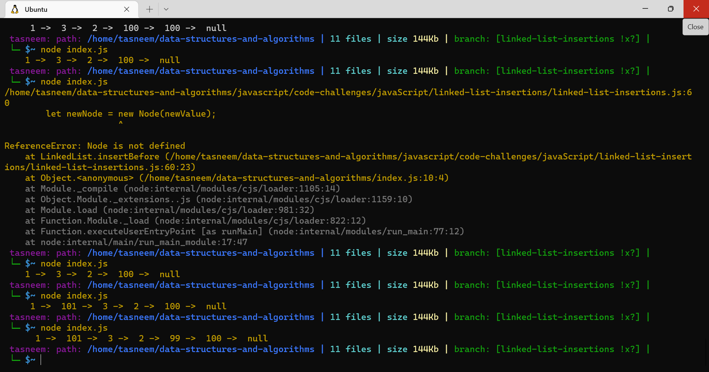
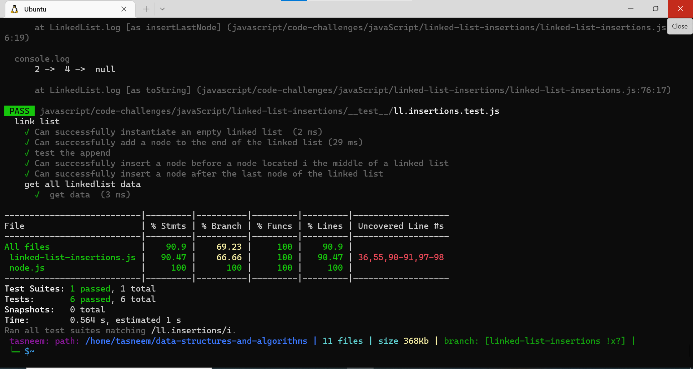
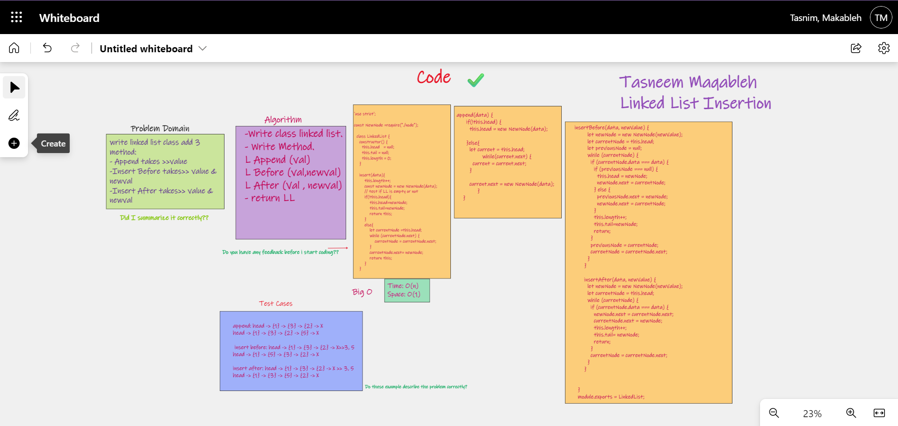

⏩⏩⏩⏩⏩⏩⏩⏩⏩⏩⏩⏩
## Code Challenge- Class 06 : linked-list-insertions

need to create a link list constructor class along with methods to do the desired insertions actions.

## Challenge:💪 💪
create a linked list class that has methods to append, insert before, and insert after nodes.

## Approach & Efficiency: ⏱⏱
- The Big O time is O(n)
- Space is O(1) 

;
;

## WhiteBoard:

