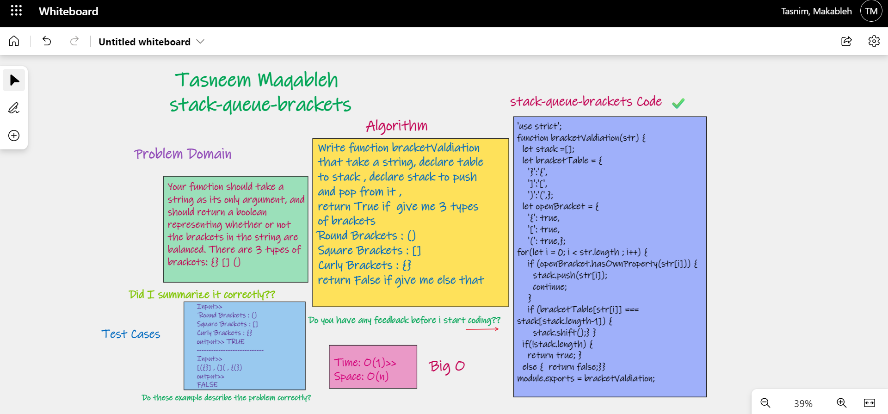

⏩⏩⏩⏩⏩⏩⏩⏩⏩⏩⏩⏩
## stack-queue-brackets
Your function should take a string as its only argument, and should return a boolean representing whether or not the brackets in the string are balanced. There are 3 types of brackets: {} [] ()

## Challenge💪 💪
make a function called validate brackets, the function should check if the bracket is balanced or not

## Approach & Efficiency ⏱⏱
space O(n)/time O(1)

## WhiteBoard : 

