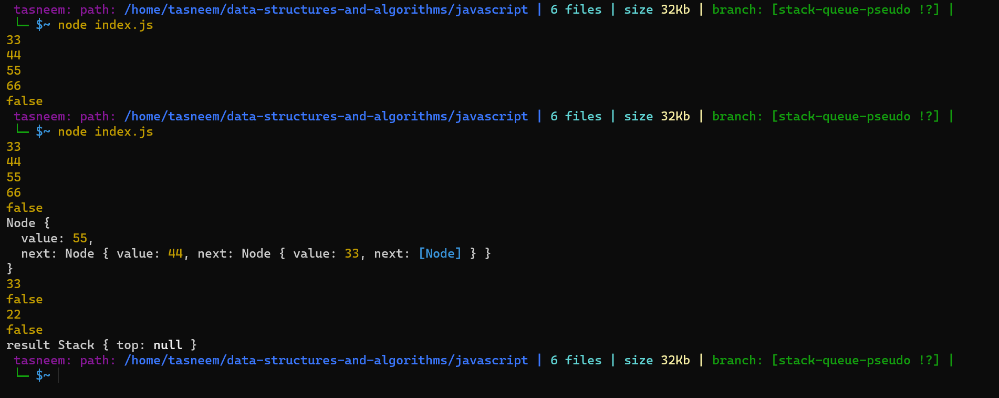
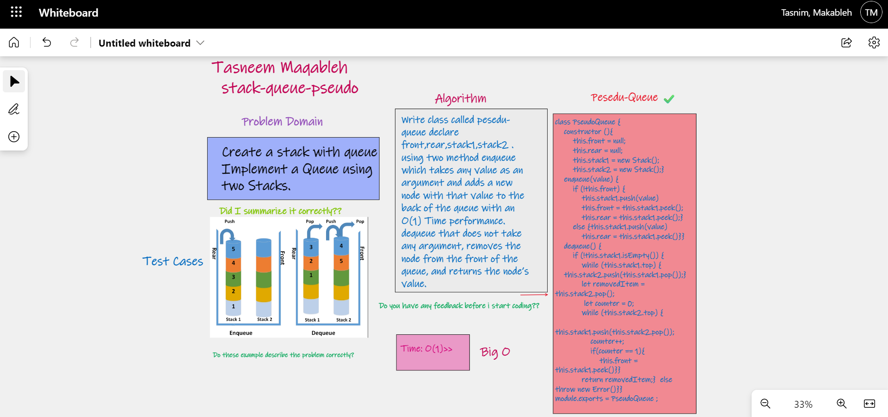

⏩⏩⏩⏩⏩⏩⏩⏩⏩⏩⏩⏩
## stack-and-queue
Implement a Queue using two Stacks.

⏩⏩ [code stack.js](./stack.js)   
⏩ ⏩ [code node.js](./node.js) 
⏩ ⏩ [code peseudo-queues.js](./pseudo-queue.js) 

📷  

## Challenge💪 💪
Create a stack with queue>> 
Stack with (push ,pop ,peek) operiations that could be applied on them.
Queue with (enqueue , dequeue) operiations that could be applied on them.

## Approach & Efficiency ⏱⏱
I used class node to import it inside the stack and queue files.
time and space for all operations : O(1);

## Stack methods: ⏱⏱
1. push which takes any value as an argument and adds a new node with that value to the top of the stack with an O(1) Time performance.

2. peek that does not take an argument and returns the value of the node located on top of the stack, without removing it from the stack.

## Queue methods: ⏱⏱
1. enqueue which takes any value as an argument and adds a new node with that value to the back of the queue with an O(1) Time performance.

2. dequeue that does not take any argument, removes the node from the front of the queue, and returns the node’s value.

## WhiteBoard : 

