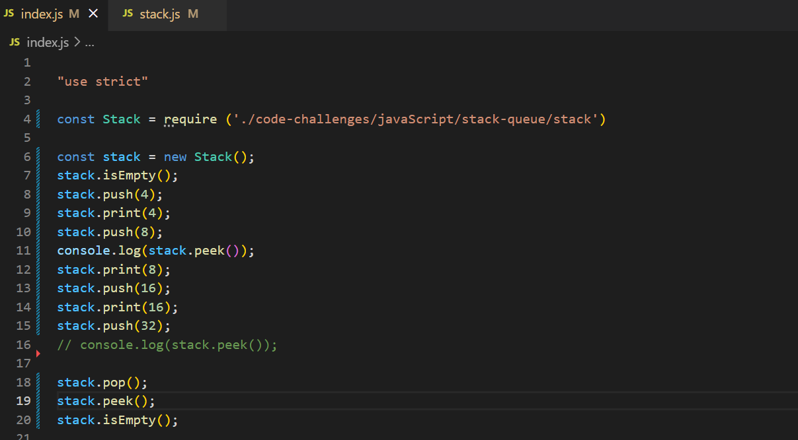
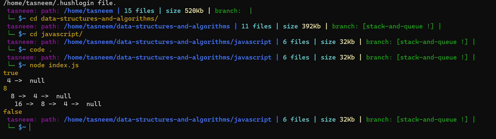
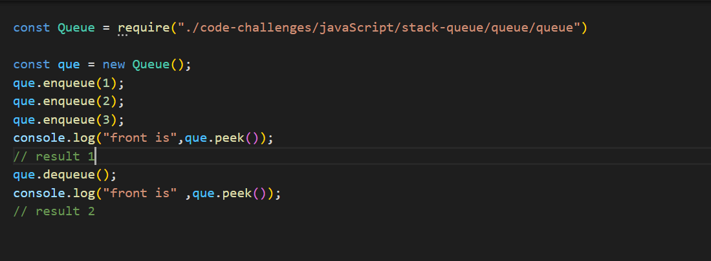
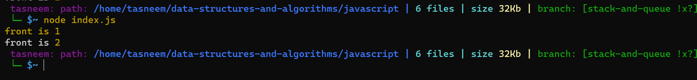
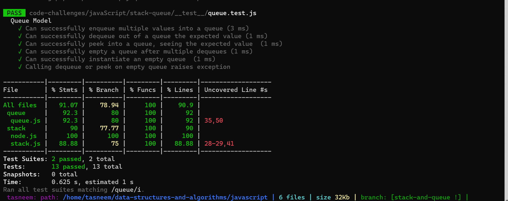

‚è©‚è©‚è©‚è©‚è©‚è©‚è©‚è©‚è©‚è©‚è©‚è©
## stack-and-queue
Implementation: Stacks and Queues 

[code stack.js](./stack/stack.js)   
[code node.js](./stack/node.js) 
[code queues.js](./queue/queue.js) 

 
 

-----------------------------------
 
 

## Challengeüí™ üí™
Create a stack and queue with all operiations that could be applied on them.

## Approach & Efficiency ⏱⏱
I used class node to import it inside the stack and queue files.
time and space for all operations : O(1);

## Stack methods: ⏱⏱
push which takes any value as an argument and adds a new node with that value to the top of the stack with an O(1) Time performance.

peek that does not take an argument and returns the value of the node located on top of the stack, without removing it from the stack.

isEmpty that takes no argument, and returns a boolean indicating whether or not the stack is empty.

## Queue methods: ⏱⏱
enqueue which takes any value as an argument and adds a new node with that value to the back of the queue with an O(1) Time performance.

dequeue that does not take any argument, removes the node from the front of the queue, and returns the node’s value.

peek that does not take an argument and returns the value of the node located in the front of the queue, without removing it from the queue.

isEmpty that takes no argument, and returns a boolean indicating whether or not the queue is empty.

