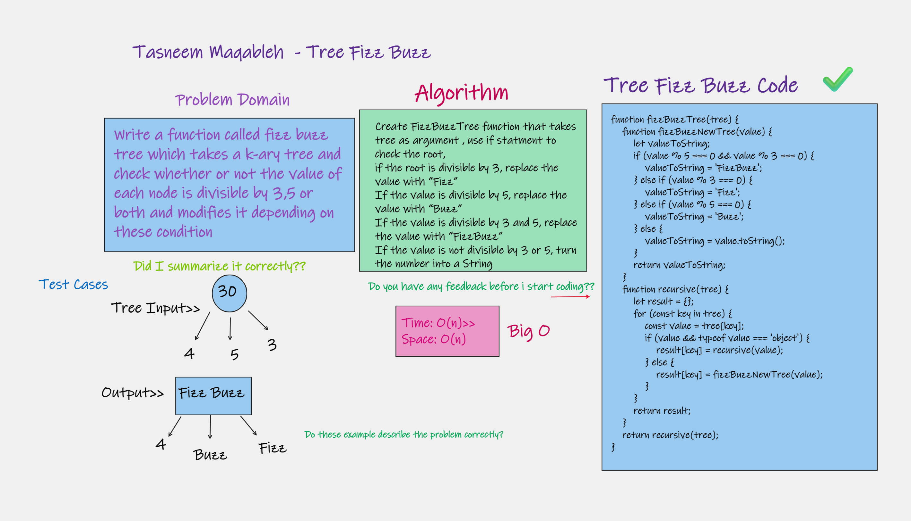
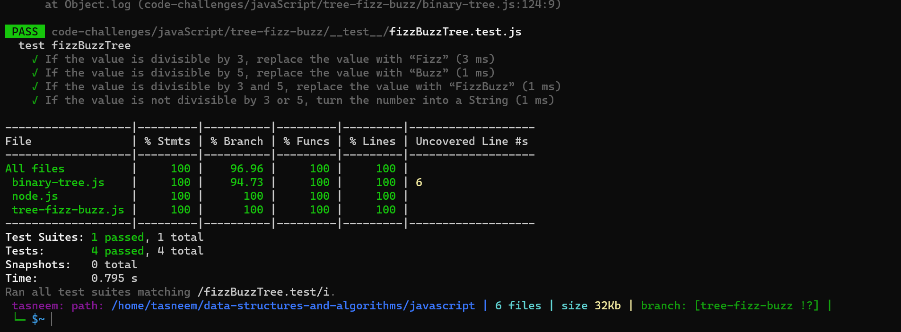

⏩⏩⏩⏩⏩⏩⏩⏩⏩⏩⏩⏩

## Tree Fizz Buzz
[code tree fuzz buzz](./tree-fizz-buzz.js)

## Challenge 💪 💪
- Write a function called fizz buzz tree
- Arguments: k-ary tree
- Return: new k-ary tree

## Approach & Efficiency
Time complexity: O(n)
Space complexity: O(n)

## WhiteBoard >>

 

