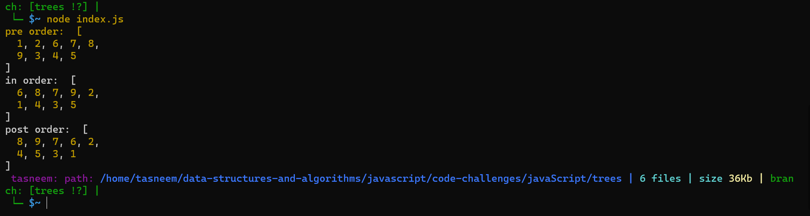
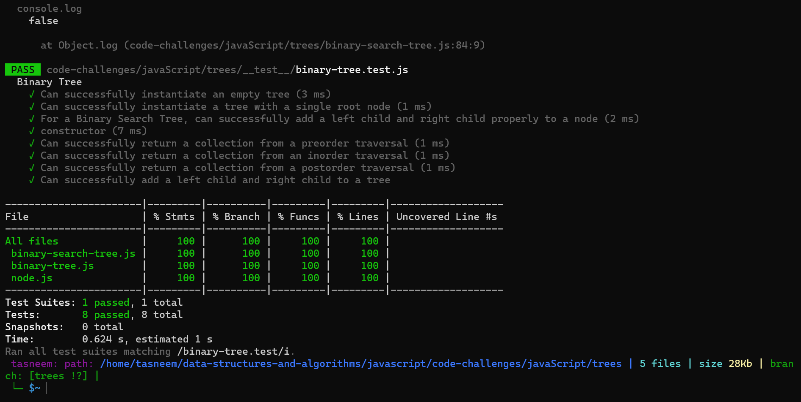

⏩⏩⏩⏩⏩⏩⏩⏩⏩⏩⏩⏩
## Trees
* Create a Node class.
* Create a BinaryTree class and it's methods.
* Create a BinarySearchTree class and it's methods.

## Challenge 💪 💪
1. Create a Node class that has properties for the value stored in the node, the left child node, and the right child node.

2. Create a BinaryTree class

3. Define a method for each of the depth first traversals called preOrder, inOrder, and postOrder which returns an array of the values, ordered appropriately.

4. Create a BinarySearchTree class

5. This class should be a sub-class (or your languages equivalent) of the Binary Tree Class, with the following additional methods:

6. Add
Arguments: value
Return: nothing
Adds a new node with that value in the correct location in the binary search tree.

7. Contains
Argument: value
Returns: boolean indicating whether or not the value is in the tree at least once.

## Big O
Binary Tree>>
1. preOrder: Time: O(n) Space: O(h) 
2. inOrder: Time: O(n) Space: O(h) 
3. postOrder: Time: O(n) Space: O(h) 
4. find_maximum_value: Time: O(n) Space: O(n) 
5. breadth_first_traversal: Time: O(n) Space: O(n)
6. Binary Search Tree add: Time: O(log n) Space: O(h) 
7. contain: Time: O(log n) Space: O(h)

## API
Binary Tree preOrder: it creates a tree (Root - Left - Right) inOrder: it creates a tree (Left - Root - Right) postOrder: it creates a tree (left - Right - Root) find_maximum_value: it returns the max value from the tree. breadth_first_traversal: it returns a list of the values in the tree in the order they were encountered.

Binary Search Tree add: it creates a sorted tree. contain: it finds if a specific value is in the tree.

⏩⏩⏩⏩⏩⏩⏩⏩⏩⏩⏩⏩
[binary-tree.js code](./binary-tree.js)

[binary-search-tree.js code](./binary-search-tree.js)

